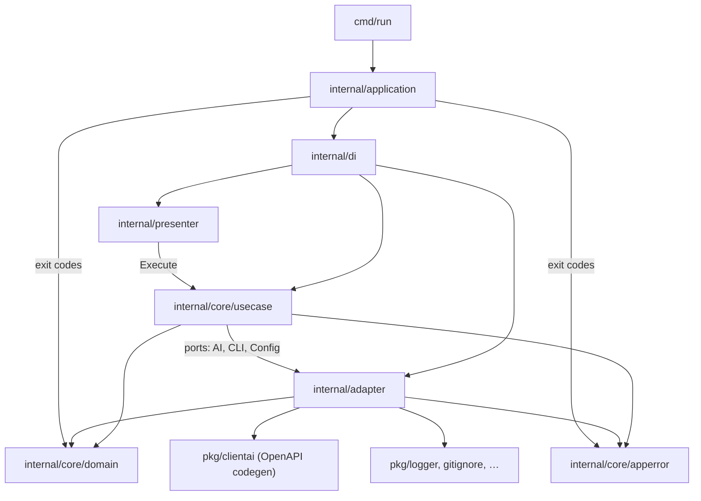
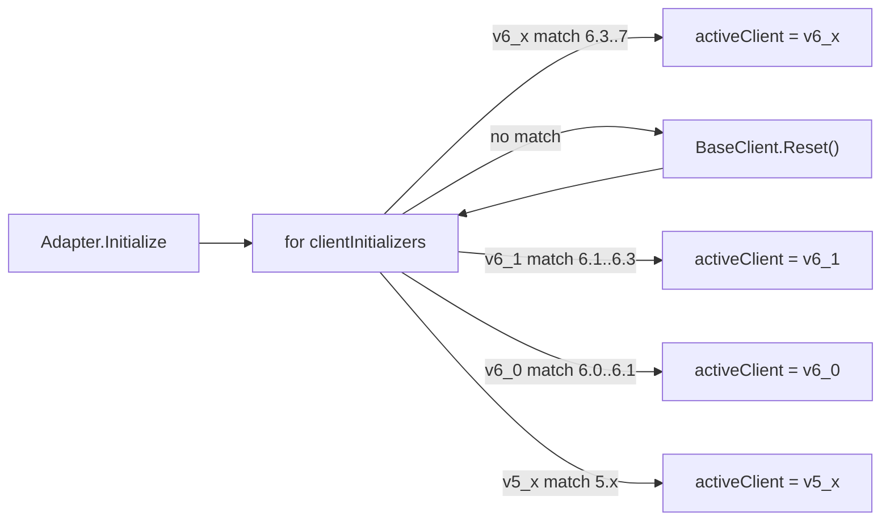

# aictl — Architecture Guide for Agents

**aictl** (Application Inspector ConTroL) — CLI для управления PT Application Inspector. Проект построен на **hexagonal architecture** с ручным DI. Архитектурные границы проверяются `go-arch-lint check` по всему репозиторию (`.go-arch-lint.yml`, `workdir: .`).

План устранения известного долга: [`doc/adr/0003-architecture-and-cli-refactoring.md`](doc/adr/0003-architecture-and-cli-refactoring.md).

## Слои и поток данных



Типичный путь команды:

1. `cmd/run/main.go` — signal context, `application.NewApplication()`, `Run()`.
2. `internal/application/application.go` — загрузка context config, `di.InitializeCmd()`, cobra `ExecuteContext`, маппинг exit code в `exitcode.go`.
3. `internal/presenter/*` — cobra-команды: флаги, `PersistentPreRunE` (logger, overlay флагов на config), вызов use case.
4. `internal/core/usecase/*` — бизнес-логика; зависит только от **локальных port-интерфейсов**, domain и при необходимости `apperror`.
5. `internal/adapter/*` — реализация портов: HTTP к AI-серверу, YAML context, stdout/stderr.

Presenter **не** импортирует adapter напрямую — только use case через интерфейс в конструкторе cobra-команды. Presenter также **не** импортирует `apperror` (arch-lint).

## Структура каталогов

| Путь | Назначение |
|------|------------|
| `cmd/run/` | Точка входа |
| `cmd/doc/` | Генерация markdown-документации команд |
| `internal/application/` | Composition root: bootstrap, exit codes (`exitcode.go`) |
| `internal/di/` | Ручной wiring: adapters → use cases → presenters (`check`, `context`, `create`, `delete`, `get`, `scan`, `set`, `update`) |
| `internal/presenter/` | Cobra CLI: `check`, `context` (`ctx`), `create`, `delete`, `get`, `scan`, `set`, `update` |
| `internal/core/usecase/` | Use cases (по одному пакету на команду/сценарий); helpers в `usecase/.utils/` |
| `internal/core/domain/` | Domain models, validation; **без** зависимостей от `pkg/` и `apperror` |
| `internal/core/apperror/` | Типизированные API/сеть/fail ошибки (не domain) |
| `internal/adapter/ai/` | Фасад AI + выбор клиента по версии сервера |
| `internal/adapter/ai/common/` | Shared: `BaseClient`, TLS/HTTP transport, JWT retry, `ClientAi`, init helpers, upload/filters/license |
| `internal/adapter/ai/{v5_x,v6_0,v6_1,v6_x}/` | Маппинг domain ↔ OpenAPI types (значительное дублирование) |
| `internal/adapter/ai/client/` | **Leftover** (не shared-слой); не класть новый код сюда — в `common/` |
| `internal/adapter/cli/` | Вывод в терминал, подтверждения |
| `internal/adapter/config/` | Чтение/запись `context.yaml` |
| `pkg/clientai/{v5_x,v6_0,v6_1,v6_x}/` | **Только** OpenAPI codegen (`backend.gen.go`, `swagger.yaml`) |
| `pkg/logger/`, `pkg/fshelper/`, `pkg/gitignore/`, `pkg/version/`, `pkg/metric/` | Утилиты без зависимостей от `internal/` |
| `tests/e2e/`, `tests/integration/` | Внешние/интеграционные тесты (e2e — build tag `e2e`) |

## Правила зависимостей (go-arch-lint)

Компоненты и разрешённые зависимости (см. `.go-arch-lint.yml`):

| Компонент | Может зависеть от |
|-----------|-------------------|
| `domain` | только `domain` |
| `apperror` | только `apperror` |
| `core` (use cases) | `apperror`, `core`, `domain`, `pkg_lib` |
| `presenter` | `core`, `presenter`, `domain`, `pkg_lib` |
| `adapter` | `adapter`, `apperror`, `domain`, `pkg_clientai`, `pkg_lib` |
| `di` | `adapter`, `application`, `core`, `di`, `presenter`, `domain`, `pkg_clientai`, `pkg_lib` |
| `application` | `adapter`, `application`, `apperror`, `core`, `di`, `presenter`, `domain`, `pkg_lib` |
| `cmd` | `application`, `pkg_lib` |
| `pkg_clientai` | только `pkg_clientai` |
| `pkg_lib` | только `pkg_lib` (`logger`, `fshelper`, `gitignore`, `metric`, `version`) |
| `tests` | `tests`, `adapter`, `apperror`, `domain`, `pkg_lib` |

**Критично для агентов:**

- Use cases и domain **не импортируют** `pkg/clientai` — маппинг API только в `internal/adapter/ai/`.
- `pkg/` не импортирует `internal/`.
- Validation errors живут в `internal/core/domain/validation/`; domain **не** зависит от `apperror`.
- Сетевые/API/fail ошибки — в `internal/core/apperror/`; маппинг в exit codes — **только** в `internal/application/exitcode.go`.

Перед PR: `go-arch-lint check`, `golangci-lint run`, `go test ./...`.

## Ports (интерфейсы use case)

Каждый use case объявляет **свои** минимальные интерфейсы `AI`, `CLI`, иногда `Config` — осознанный ISP. Mockery генерирует моки рядом с исходником (`{file}_mock.go`); в `.mockery.yml` перечислены пакеты с тестами (~9 пакетов).

Пример (`get/healthcheck`):

```go
type AI interface {
    InitializeWithRetry(ctx context.Context) error
    GetHealthcheck(ctx context.Context) (bool, error)
}
type CLI interface {
    ReturnText(ctx context.Context, text string)
}
```

`internal/adapter/ai.Adapter` делегирует в `activeClient`; тип `ClientAi` объявлен в `common/client_ai.go` (~47 методов). Формальной связи между `ClientAi` и портами use case **нет** — compile-time проверка только через DI.

### Initialize vs InitializeWithRetry

| Метод | Поведение |
|-------|-----------|
| `Initialize` | Table-driven выбор клиента `v6_x` → `v6_1` → `v6_0` → `v5_x`, проверка версии и лицензии (`init.go` + `common.Initializer`) |
| `InitializeWithRetry` | `Initialize` + `AddJwtRetry()` на активном клиенте |

**Несогласованность (техдолг, ADR-0003):** большинство use cases вызывают `InitializeWithRetry`; `create/branch` и `update/sources` — только `Initialize`. В `create/branch` wrap ошибочно говорит `"initialize with retry"`. При добавлении команд — **предпочитать `InitializeWithRetry`**, пока исключения не унифицированы.

## AI adapter: версионирование 5.x / 6.0 / 6.1–6.2 / 6.3+



- Поддерживаемый диапазон: **5.0.0 ≤ ver < 7.0.0**.
- Порядок попыток: **6.3+** (`v6_x`) → **6.1–6.2** (`v6_1`) → **6.0.x** (`v6_0`) → **5.x** (`v5_x`). При несовпадении — `BaseClient.Reset()` и следующий initializer.
- Границы: `v6_0` → `[6.0.0, 6.1.0)`, `v6_1` → `[6.1.0, 6.3.0)`, `v6_x` → `[6.3.0, 7.0.0)`.
- Все клиенты делят один `common.BaseClient` (JWT, HTTP). **Параллельное использование двух клиентов невозможно** — shared mutable state.
- Ручной маппинг: `internal/adapter/ai/v*/client.go` (~1250–1400 строк каждый, сильное дублирование).
- Codegen: `pkg/clientai/v*/` — `go generate` в `gen.go`.

При правках scan/settings/report — проверять **все четыре** адаптера или выносить shared helpers в **`internal/adapter/ai/common/`** (не в `client/`).

**TLS:** `common/tls.go` — clone `http.DefaultTransport` (сохраняет HTTP/2), `--cacert` vs `--tls-skip` mutually exclusive; CA PEM **дописывается** к system roots.

**SBOM (AIE ≥ 6.3, только `v6_x`):** `create sbom-project --file`, `update sbom`, `scan sbom`; type guards на source-only командах; `get projects` колонка `TYPE` (`source`/`sbom`). Канонический старт source-скана: `scan branch` / `scan project` (`scan start *` obsolete, ещё в CLI для совместимости).

**SCA feeds (AIE ≥ 6.3, только `v6_x`):** `get sca-feeds` (list / download by version), `update sca-feeds <zip> --version <ver>` (upload), `update sca-feeds rollback` (confirm / `-y`; stdout = новая version). Upload: `POST /api/packages/sca_feeds` (multipart + MD5). На младших версиях — `SCA feeds is supported starting from AIE 6.3`.

**License on scan start:** после `IsValid` на Initialize лицензия кэшируется; перед `scan branch` / `scan project` / `scan sbom` сверяются project settings — нелицензированные языки hard-fail (кроме sbom), SCA/Components/MOLOT soft-disable с persist + warn на stderr.

## DI (composition root)

`internal/di/container.go` — точка сборки; wiring по файлам:

- `adapters.go` — `config.Adapter`, `cli.Adapter`, `ai.Adapter`
- `check.go`, `context.go`, `create.go`, `delete.go`, `get.go`, `scan.go`, `set.go`, `update.go`

Паттерн в каждом `build*Cmd`:

```go
uc, err := someUseCase.NewUseCase(a.ai, a.cli, a.cfg)
cmd := presenter.NewSomeCmd(uc)
```

**Дублирование bootstrap:** `application.NewApplication()` загружает config через `adapter/config` до DI; в `di/adapters.go` создаётся ещё один `configAdapter` для `ctx`-команд. Известный нюанс — не объединять без явной задачи (ADR-0003 фаза 5).

## Config и context

- Domain model: `internal/core/domain/config/` — URI, token, TLS skip, CA cert path (`--cacert`), project/branch UUID.
- Persistence: `~/.config/aictl/context.yaml` (через `adapter/config`).
- CLI: команда **`ctx`** (пакет presenter — `context`).
- Overlay: `-u/--uri`, `-t/--token`, `--tls-skip`, `--cacert` на connection-командах через `presenter/.utils/cmd.go` → `UpdateConnectionConfig` + `cfg.Validate()`. `--cacert` и `--tls-skip` взаимоисключающие; сброс CA — `ctx unset --cacert`.
- Ошибки чтения/unmarshal `context.yaml` сейчас **молча** возвращают пустой config (`// TODO add log`) — техдолг ADR-0003.

## Обработка ошибок и exit codes

Единая точка маппинга: `internal/application/exitcode.go`.

| Категория | Типы | Exit code |
|-----------|------|-----------|
| Validation | `domain/validation.*` | **1** |
| Fail flags / сценарий | `apperror.FailError`, `EmptyResponseError` | **1** |
| API / auth / not found / server | `AuthenticationError`, `AuthorizationError`, `BadRequest*`, `NotFound*`, `ServerResponseError`, `UnknownResponseError`, `*ApiErrorModel*` | **2** |
| Прочее | нераспознанные / domain sentinels без `%w` / plain `fmt.Errorf` | **-1** |

Use cases оборачивают через `fmt.Errorf("…: %w", err)` — для `errors.As` важна цепочка `%w` (не `%s` / `%v` для typed errors).

Validation types: `Error`, `FieldError`, `RequiredError`, `InvalidError`, `MessageError`.

**Известный долг:** часть version-gate / presenter validation (например label) и stubs с `fmt.Errorf("%s", const)` попадают в **-1** вместо **1**. При новых ошибках — сразу `validation` или `%w` на sentinel/`apperror`.

## Presenter conventions

- Каждая команда: struct с `*cobra.Command`, конструктор `New*Cmd(useCase)`.
- Use case — **локальный интерфейс** с `Execute(ctx, …)`.
- Connection-команды: `_utils.AddConnectionPersistentFlags`, `_utils.ChainRunE(_utils.UpdateConfig(cfg), …)`.
- Offline: `check aiproj` — без connection flags.
- Root: `PersistentPreRunE: _utils.InitializeLogger` — logger в context (`pkg/logger`).
- При ошибке use case: `cmd.SilenceUsage = true`, wrap с именем команды.
- Helpers: `presenter/.utils/` (имя с точкой — историческое).

### CLI semantics (важно для UX)

| Группа | Смысл |
|--------|--------|
| `set project settings/policies/exclusions` | **Полная замена** ресурса (aiproj / JSON / text) |
| `update project settings` | **Patch** priority / preferred agents (AIE ≥ 6.0) |
| `update project languages` | Пересчёт языков на сервере |
| `update sources` / `update sbom` / `update sca-feeds` | Загрузка артефактов |
| `update sca-feeds rollback` | Откат current SCA feeds (predecessor выбирает сервер) |
| `get sca-feeds` / `get sca-feeds <version>` | Список / скачивание SCA feeds |
| `scan branch` / `scan project` / `scan sbom` | Канонический старт скана |
| `scan start *` | Deprecated: скрыт из completion/help родителя, в `doc/gen` и `doc/aictl.md` остаётся; при вызове — warning |

## Тестирование

Покрытие заметно шире ранних оценок: порядка **~90+** `*_test.go` под `internal/` плюс `tests/e2e` и `tests/integration`. Моки Mockery (~9) используются в соответствующих пакетах.

Ориентиры:

- `internal/adapter/ai/client_test.go`, `common/init_test.go` — version bounds / init;
- `internal/adapter/ai/common/tls_test.go` — TLS / HTTP/2 / cacert;
- `internal/application/exitcode_*.go` — exit mapping;
- use case / presenter tests по критичным командам;
- e2e: `tests/e2e` (build tag `e2e`, внешние стенды).

При добавлении тестов — приоритет: init 6.3→6.1→6.0→5x, exit codes, scan/license, новые version gates.

## Рекомендации при изменениях

1. **Новая команда:** domain (если нужны типы) → use case с локальными ports → presenter cobra → wiring в `internal/di/*.go` (+ `check.go` для offline).
2. **Новый AI-метод:** `common.ClientAi` + `Adapter` delegate → реализовать в **четырёх** `v5_x` / `v6_0` / `v6_1` / `v6_x` (или stub с typed unsupported) → port use case.
3. **OpenAPI изменился:** обновить `swagger.yaml`, `go generate` в `pkg/clientai/v*/`, затем adapter mapping.
4. **Не нарушать arch-lint:** use case не импортирует adapter или `pkg/clientai`.
5. **Shared logic 5x/6.0/6.1/6.x:** выносить в **`internal/adapter/ai/common/`** — главный источник регрессий при дублировании.
6. **Exit codes:** validation / fail → `exitcode.go` через typed errors; API → `apperror`; не глотать identity через `fmt.Errorf("%s", err)`.
7. **Init:** по умолчанию `InitializeWithRetry`.

## CI

GitHub Actions: `arch-lint`, `golangci-lint`, `test`, `check-doc` (генерация `doc/gen/`).

Optional local setup: root `devenv.nix` / `.envrc` — **not a team standard yet**; use only if already adopted. Do not require devenv for contributors. `go.work` может ссылаться на соседние модули локально — не коммитить чужие пути как обязательные.

## Документация

- `doc/aictl.md` — пользовательский гайд (обзор, установка, коды выхода, команды)
- `doc/gen/` — автоген markdown по cobra (`task doc` / `check-doc`)
- `doc/migration/` — миграция с aisa / ptai-cli-plugin
- `doc/adr/` — ADR (в т.ч. 0003 — рефакторинг архитектуры/CLI)
- `AGENTS.md` — этот файл (для агентов и контрибьюторов)
